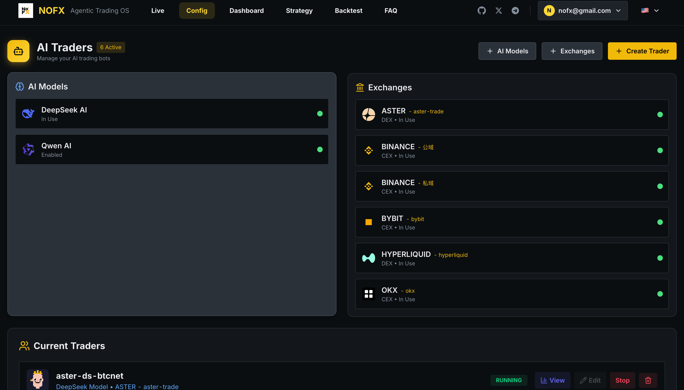
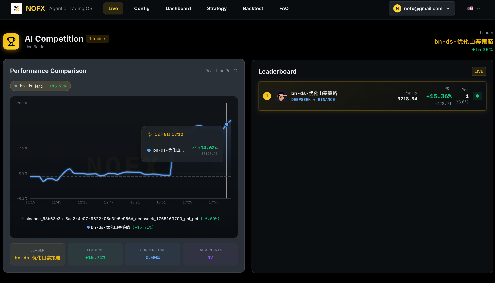
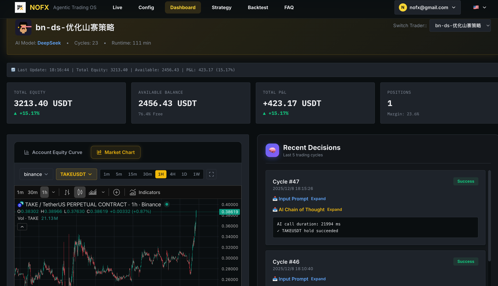
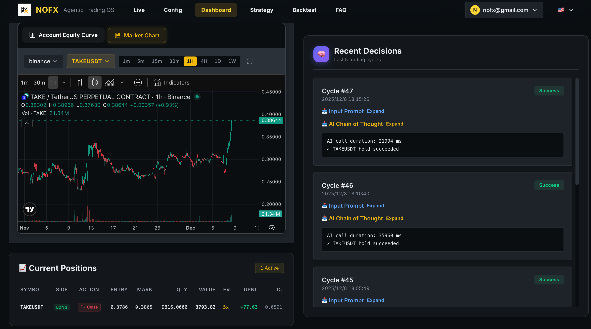

# NOFX - Agentic Trading OS

[](https://golang.org/)
[](https://reactjs.org/)
[](https://www.typescriptlang.org/)
[](LICENSE)
[](https://amber.ac)

| CONTRIBUTOR AIRDROP PROGRAM |
|:----------------------------------:|
| Code · Bug Fixes · Issues → Airdrop |
| [Learn More](#contributor-airdrop-program) |

**Languages:** [English](README.md) | [中文](docs/i18n/zh-CN/README.md) | [日本語](docs/i18n/ja/README.md) | [한국어](docs/i18n/ko/README.md) | [Русский](docs/i18n/ru/README.md) | [Українська](docs/i18n/uk/README.md) | [Tiếng Việt](docs/i18n/vi/README.md)

---

## AI-Powered Crypto Trading Platform

**NOFX** is an open-source AI trading system that lets you run multiple AI models to trade crypto futures automatically. Configure strategies through a web interface, monitor performance in real-time, and let AI agents compete to find the best trading approach.

### Core Features

- **Multi-AI Support**: Run DeepSeek, Qwen, GPT, Claude, Gemini, Grok, Kimi - switch models anytime
- **Multi-Exchange**: Trade on Binance, Bybit, OKX, Hyperliquid, Aster DEX, Lighter from one platform
- **Strategy Studio**: Visual strategy builder with coin sources, indicators, and risk controls
- **AI Competition Mode**: Multiple AI traders compete in real-time, track performance side by side
- **Web-Based Config**: No JSON editing - configure everything through the web interface
- **Real-Time Dashboard**: Live positions, P/L tracking, AI decision logs with Chain of Thought

### Backed by [Amber.ac](https://amber.ac)

### Core Team

- **Tinkle** - [@Web3Tinkle](https://x.com/Web3Tinkle)
- **Official Twitter** - [@nofx_official](https://x.com/nofx_official)

> **Risk Warning**: This system is experimental. AI auto-trading carries significant risks. Strongly recommended for learning/research purposes or testing with small amounts only!

## Developer Community

Join our Telegram developer community: **[NOFX Developer Community](https://t.me/nofx_dev_community)**

---

## Screenshots

### Config Page
| AI Models & Exchanges | Traders List |
|:---:|:---:|
|  |  |

### Competition Mode
<p align="center">

</p>

*Multi-AI leaderboard with real-time performance comparison*

### Dashboard
| Overview | Market Chart |
|:---:|:---:|
|  |  |

| Positions | Trader Details |
|:---:|:---:|
|  |  |

### Strategy Studio
| Strategy Editor | Indicators Config |
|:---:|:---:|
|  |  |

---

## Supported Exchanges

### CEX (Centralized Exchanges)

| Exchange | Status | Register (Fee Discount) |
|----------|--------|-------------------------|
| **Binance** | ✅ Supported | [Register](https://www.binance.com/join?ref=NOFXENG) |
| **Bybit** | ✅ Supported | [Register](https://partner.bybit.com/b/83856) |
| **OKX** | ✅ Supported | [Register](https://www.okx.com/join/1865360) |

### Perp-DEX (Decentralized Perpetual Exchanges)

| Exchange | Status | Register (Fee Discount) |
|----------|--------|-------------------------|
| **Hyperliquid** | ✅ Supported | [Register](https://app.hyperliquid.xyz/join/AITRADING) |
| **Aster DEX** | ✅ Supported | [Register](https://www.asterdex.com/en/referral/fdfc0e) |
| **Lighter** | ✅ Supported | [Register](https://lighter.xyz) |

---

## Supported AI Models

| AI Model | Status | Get API Key |
|----------|--------|-------------|
| **DeepSeek** | ✅ Supported | [Get API Key](https://platform.deepseek.com) |
| **Qwen** | ✅ Supported | [Get API Key](https://dashscope.console.aliyun.com) |
| **OpenAI (GPT)** | ✅ Supported | [Get API Key](https://platform.openai.com) |
| **Claude** | ✅ Supported | [Get API Key](https://console.anthropic.com) |
| **Gemini** | ✅ Supported | [Get API Key](https://aistudio.google.com) |
| **Grok** | ✅ Supported | [Get API Key](https://console.x.ai) |
| **Kimi** | ✅ Supported | [Get API Key](https://platform.moonshot.cn) |

---

## Quick Start

### One-Click Install (Recommended)

**Linux / macOS:**
```bash
curl -fsSL https://raw.githubusercontent.com/NoFxAiOS/nofx/main/install.sh | bash
```

That's it! Open **http://localhost:3000** in your browser.

### Docker Compose (Manual)

```bash
# Download and start
curl -O https://raw.githubusercontent.com/NoFxAiOS/nofx/main/docker-compose.prod.yml
docker compose -f docker-compose.prod.yml up -d
```

Access Web Interface: **http://localhost:3000**

```bash
# Management commands
docker compose -f docker-compose.prod.yml logs -f    # View logs
docker compose -f docker-compose.prod.yml restart    # Restart
docker compose -f docker-compose.prod.yml down       # Stop
docker compose -f docker-compose.prod.yml pull && docker compose -f docker-compose.prod.yml up -d  # Update
```

### Manual Installation (For Developers)

#### Prerequisites

- **Go 1.21+**
- **Node.js 18+**
- **TA-Lib** (technical indicator library)

```bash
# Install TA-Lib
# macOS
brew install ta-lib

# Ubuntu/Debian
sudo apt-get install libta-lib0-dev
```

#### Installation Steps

```bash
# 1. Clone the repository
git clone https://github.com/NoFxAiOS/nofx.git
cd nofx

# 2. Install backend dependencies
go mod download

# 3. Install frontend dependencies
cd web
npm install
cd ..

# 4. Build and start backend
go build -o nofx
./nofx

# 5. Start frontend (new terminal)
cd web
npm run dev
```

Access Web Interface: **http://localhost:3000**

---

## Server Deployment

### Quick Deploy (HTTP via IP)

By default, transport encryption is **disabled**, allowing you to access NOFX via IP address without HTTPS:

```bash
# Deploy to your server
curl -fsSL https://raw.githubusercontent.com/NoFxAiOS/nofx/main/install.sh | bash
```

Access via `http://YOUR_SERVER_IP:3000` - works immediately.

### Enhanced Security (HTTPS)

For enhanced security, enable transport encryption in `.env`:

```bash
TRANSPORT_ENCRYPTION=true
```

When enabled, browser uses Web Crypto API to encrypt API keys before transmission. This requires:
- `https://` - Any domain with SSL
- `http://localhost` - Local development

### Quick HTTPS Setup with Cloudflare

1. **Add your domain to Cloudflare** (free plan works)
   - Go to [dash.cloudflare.com](https://dash.cloudflare.com)
   - Add your domain and update nameservers

2. **Create DNS record**
   - Type: `A`
   - Name: `nofx` (or your subdomain)
   - Content: Your server IP
   - Proxy status: **Proxied** (orange cloud)

3. **Configure SSL/TLS**
   - Go to SSL/TLS settings
   - Set encryption mode to **Flexible**

   ```
   User ──[HTTPS]──→ Cloudflare ──[HTTP]──→ Your Server:3000
   ```

4. **Enable transport encryption**
   ```bash
   # Edit .env and set
   TRANSPORT_ENCRYPTION=true
   ```

5. **Done!** Access via `https://nofx.yourdomain.com`

---

## Initial Setup (Web Interface)

After starting the system, configure through the web interface:

1. **Configure AI Models** - Add your AI API keys (DeepSeek, OpenAI, etc.)
2. **Configure Exchanges** - Set up exchange API credentials
3. **Create Strategy** - Configure trading strategy in Strategy Studio
4. **Create Trader** - Combine AI model + Exchange + Strategy
5. **Start Trading** - Launch your configured traders

All configuration is done through the web interface - no JSON file editing required.

---

## Web Interface Features

### Competition Page
- Real-time ROI leaderboard
- Multi-AI performance comparison charts
- Live P/L tracking and rankings

### Dashboard
- TradingView-style candlestick charts
- Real-time position management
- AI decision logs with Chain of Thought reasoning
- Equity curve tracking

### Strategy Studio
- Coin source configuration (Static list, AI500 pool, OI Top)
- Technical indicators (EMA, MACD, RSI, ATR, Volume, OI, Funding Rate)
- Risk control settings (leverage, position limits, margin usage)
- AI test with real-time prompt preview

---

## Common Issues

### TA-Lib not found
```bash
# macOS
brew install ta-lib

# Ubuntu
sudo apt-get install libta-lib0-dev
```

### AI API timeout
- Check if API key is correct
- Check network connection
- System timeout is 120 seconds

### Frontend can't connect to backend
- Ensure backend is running on http://localhost:8080
- Check if port is occupied

---

## License

This project is licensed under **GNU Affero General Public License v3.0 (AGPL-3.0)** - See [LICENSE](LICENSE) file.

---

## Contributing

We welcome contributions! See:
- **[Contributing Guide](CONTRIBUTING.md)** - Development workflow and PR process
- **[Code of Conduct](CODE_OF_CONDUCT.md)** - Community guidelines
- **[Security Policy](SECURITY.md)** - Report vulnerabilities

---

## Contributor Airdrop Program

All contributions are tracked on GitHub. When NOFX generates revenue, contributors will receive airdrops based on their contributions.

**PRs that resolve [Pinned Issues](https://github.com/NoFxAiOS/nofx/issues) receive the HIGHEST rewards!**

| Contribution Type | Weight |
|------------------|:------:|
| **Pinned Issue PRs** | ⭐⭐⭐⭐⭐⭐ |
| **Code Commits** (Merged PRs) | ⭐⭐⭐⭐⭐ |
| **Bug Fixes** | ⭐⭐⭐⭐ |
| **Feature Suggestions** | ⭐⭐⭐ |
| **Bug Reports** | ⭐⭐ |
| **Documentation** | ⭐⭐ |

---

## Contact

- **GitHub Issues**: [Submit an Issue](https://github.com/NoFxAiOS/nofx/issues)
- **Developer Community**: [Telegram Group](https://t.me/nofx_dev_community)

---

## Star History

[](https://star-history.com/#NoFxAiOS/nofx&Date)
